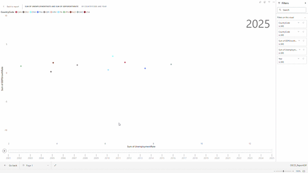
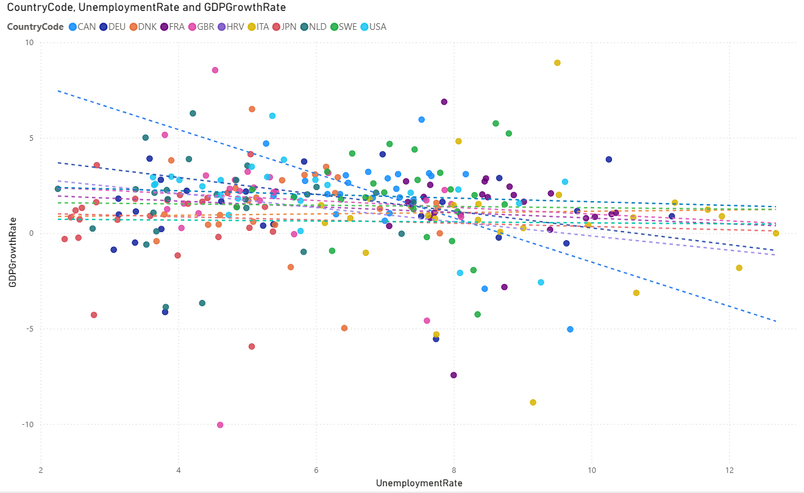

# OECD Economic Analysis - Microsoft Fabric Portfolio

## Overview
A Microsoft Fabric Lakehouse project that analyzes the relationship between unemployment rates and GDP growth rates across 11 countries using a modern data engineering architecture.

### Technology Stack
Microsoft Fabric Lakehouse | PySpark | Spark SQL | Delta Lake | Power BI

## Objective
To design and implement a scalable economic analytics platform using Microsoft Fabric Lakehouse, covering data ingestion, transformation, dimensional modeling, and reporting.

## Countries
G7 (Japan, USA, Canada, UK, Germany, France, Italy) + Netherlands, Sweden, Denmark, Croatia

## Data Source
- OECD Data Explorer: Annual Labour Force Survey (Unemployment Rate)
- OECD Data Explorer: NAAG Chapter 1 GDP (GDP Growth Rate)
- Period: 2000-2024

## Architecture
Medallion Architecture (Bronze / Silver / Gold)

### Bronze
- Raw CSV files from OECD

### Silver
- Cleaned and selected columns
- Renamed to business-friendly names

### Gold
- dimCountry
- dimYear
- factEconomic (Unemployment Rate and GDP Growth Rate)

## Technical Highlights
- Designed and implemented an end-to-end analytics platform 
  using Microsoft Fabric Lakehouse, from raw OECD data ingestion 
  to Power BI reporting
- Implemented Medallion Architecture (Bronze / Silver / Gold) 
  using Delta Lake tables
- Developed data transformation processes using PySpark and Spark SQL
- Standardized and cleansed OECD datasets for analytical consumption
- Designed and implemented a dimensional data model 
  (dimCountry, dimYear, factEconomic)
- Stored curated datasets in Delta Lake format for scalable analytics
- Enabled interactive reporting and trend analysis 
  through Power BI dashboards
  
## Demo
*Scatter plot showing unemployment rate vs GDP growth rate by country, animated by year (2000-2024)*

## Visualization

## Data Model

## Business Insights
- No strong overall correlation was found between unemployment rates and GDP growth rates across the analyzed countries.
- Canada showed the strongest negative correlation among all countries analyzed.

> **Note:** Croatia (HRV) joined OECD in 2023, so GDP growth rate data is limited and excluded from trend analysis.
