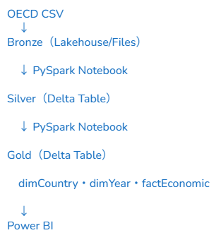
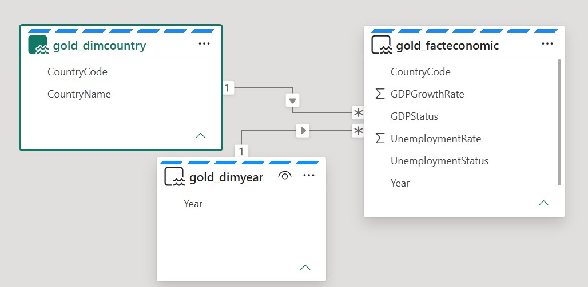

# OECD経済分析 - Microsoft Fabric ポートフォリオ

## 概要

Microsoft Fabric Lakehouseを使用して、11カ国の失業率とGDP成長率の関係を分析したデータエンジニアリングプロジェクトです。

### 使用技術

Microsoft Fabric Lakehouse | PySpark | Spark SQL | Delta Lake | Power BI

## 目的

Microsoft Fabric Lakehouseを活用した経済データ分析基盤の設計・構築。データ取得からトランスフォーメーション、ディメンショナルモデリング、レポーティングまでを一貫して実装しました。

## 対象国

G7（日本・アメリカ・カナダ・イギリス・ドイツ・フランス・イタリア）＋ オランダ・スウェーデン・デンマーク・クロアチア

## データソース

- OECD Data Explorer：年次労働力調査（失業率）
- OECD Data Explorer：NAAG Chapter 1 GDP（GDP成長率）
- 対象期間：2000年〜2024年

## アーキテクチャ

メダリオンアーキテクチャ（Bronze / Silver / Gold）

### Bronze

- OECDからダウンロードした生CSVファイルをそのまま格納

### Silver

- 不要カラムの除外・列名の整理
- 分析用途に合わせたデータ型変換

### Gold

- dimCountry（国マスタ）
- dimYear（年マスタ）
- factEconomic（失業率・GDP成長率）

## 技術的なポイント

- Microsoft Fabric Lakehouseを用いて、OECDデータの取得からPower BIレポートまで一貫したデータ基盤を設計・構築
- Delta Lakeテーブルによるメダリオンアーキテクチャ（Bronze / Silver / Gold）を実装
- PySparkおよびSpark SQLを活用したデータ変換処理を開発
- OECDデータセットの標準化・クレンジングを実施し、分析用途に最適化
- ディメンショナルデータモデル（dimCountry・dimYear・factEconomic）を設計・実装
- Delta Lake形式でデータを保存し、スケーラブルな分析基盤を構築
- Power BIダッシュボードによるインタラクティブなトレンド分析を実現

## デモ

*失業率とGDP成長率の散布図（国別・2000〜2024年のアニメーション表示）*

## ビジュアライゼーション

## データモデル

## 分析から得られた知見

- 失業率とGDP成長率の間に、全体的な強い相関関係は確認できませんでした。
- 個別に見ると、カナダが最も強い負の相関を示しました。

> **補足：** クロアチア（HRV）は2023年にOECDへ加盟したため、GDP成長率のデータが限定的であり、トレンド分析の対象から除外しています。
